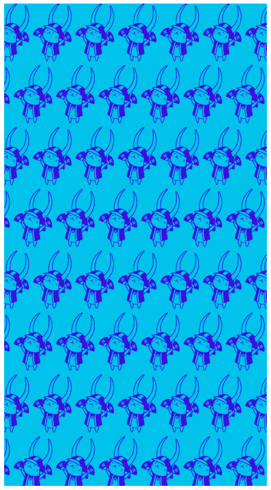
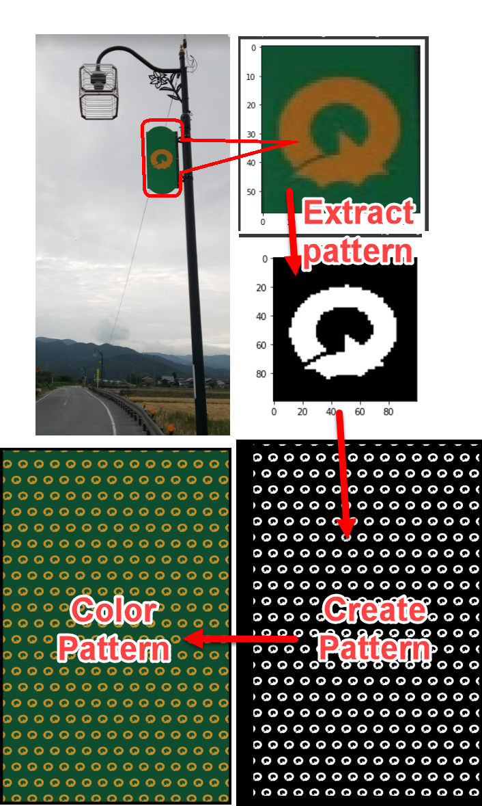

# Tenugui creater 手ぬぐいを作成する
This code create a Tengui, a japanese style cloth patter from a simple desing loaded in.
 
Currently work in progress. 作成中
 

* [X]  Bacis code (pattern_edit.py) 2021/07/09
* [X]  GoogleColob Notebook 2021/07/10
* [ ]  Multiple patterns 
* [ ]  more than 2 color options 

<h2> Run notebook </h2>

* Create_design_notebook.ipynb 

<h1>Design create example, color inversion & contours added 20210711</h1>

<h1>Desgin Creation example (2021/07/10) </h1>

<h1> Example 2021/07/09 Rain dragon

